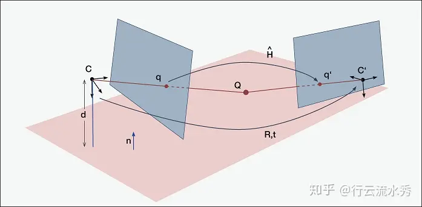
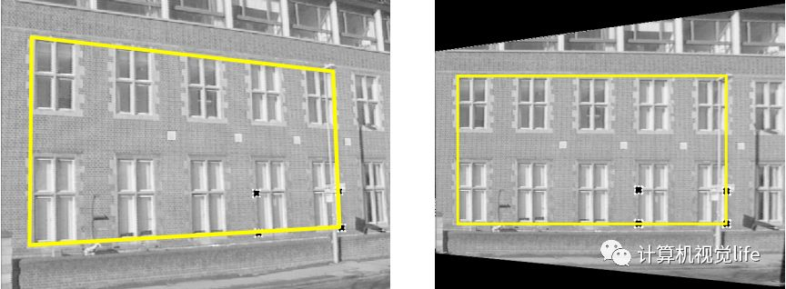
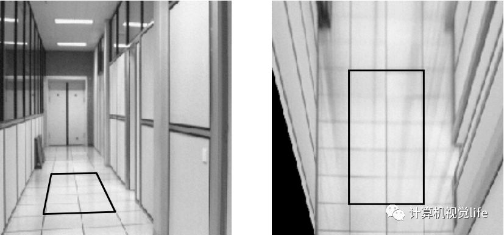
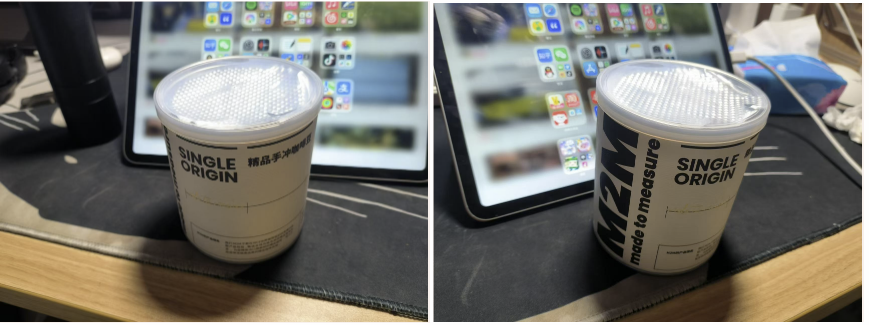
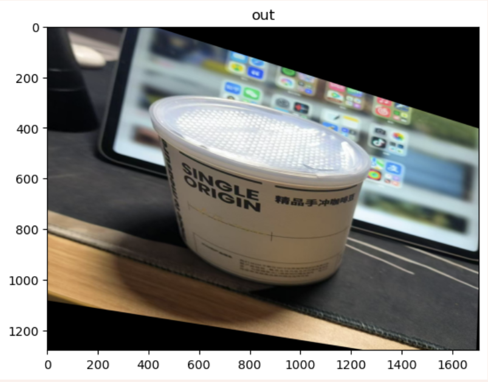
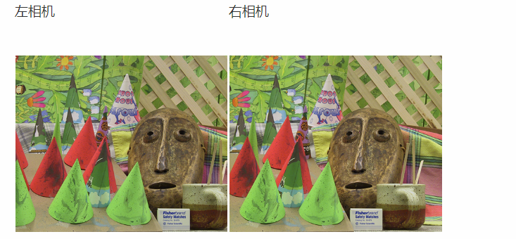
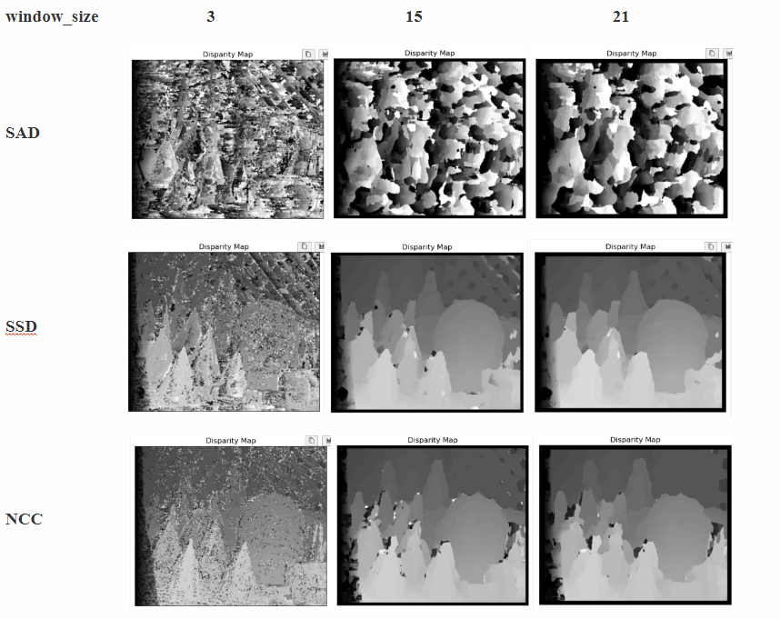

- [单应性变换](#单应性变换)
      - [原理](#原理)
      - [实验](#实验)
        - [两张图片](#两张图片)
        - [**结果**](#结果)
        - [分析](#分析)
- [图像视差匹配](#图像视差匹配)
      - [原理](#原理-1)
      - [实现——相似度匹配，视差计算](#实现相似度匹配视差计算)
        - [三种相似度的实验结果](#三种相似度的实验结果)
        - [计算时间](#计算时间)
      - [分析](#分析-1)
        - [SAD算法的效果](#sad算法的效果)
        - [错误表现](#错误表现)
        - [窗口大小的变化](#窗口大小的变化)
        - [计算时间](#计算时间-1)

## 单应性变换

##### 原理

单应(Homography)是射影几何中的概念，又称为射影变换。它把一个射影平面上的点(三维齐次矢量)映射到另一个射影平面上，并且把直线映射为直线，具有保线性质。总的来说，单应是关于三维齐次矢量的一种线性变换，可以用一个3×3的非奇异矩阵H表示，简单来说单应性变换是一个平面到另一个平面的变换关系

Planar Homography：如果两台相机所拍摄的场景为同一个平面，则两台相机之间的关系称为Planar Homography。

Homography：如果两台相机拍摄的是同一个场景，但两台相机之间只有旋转角度的不同，没有任何位移，则这两台相机之间的关系称为Homography。

图中两台相机相对于平面上的三维坐标点拍照，以 𝑄 表示该点相对于Camera 𝐶 的相机坐标， 𝑄′ 表示相对Camera 𝐶′ 的相机坐标，则 𝑄 和 𝑄′ 之间的关系为： 𝑄′=𝑅𝑄+𝑡 , 𝑅 和 𝑇 分别是相机 和𝐶和𝐶′ 相对旋转 rotation和位移translation。

**单应性在计算机视觉中的应用**

单应性在图像校正、图像拼接、相机位姿估计、视觉SLAM等领域有非常重要的作用。

1.图像校正

  用单应性矩阵进行图像校正，如下图所示，至少需要四个对应点就可以实现。

2.视角变换

  单应性矩阵用于视角变换，如下图所示，可将左边普通视图转换为右边的俯瞰视图

由于单应矩阵H包含了||H||=1约束，因此根据上图的线性方程，8自由度的H我们至少需要4对对应的点才能计算出单应矩阵，这也回答了前面图像校正中提到的为何至少需要四个点对的根本原因。然而，在真实的应用场景中，计算的点对中都会包含噪声，比如点的位置偏差几个像素，甚至出现特征点对误匹配的现象，如果只使用4个点对来计算单应矩阵，那会出现很大的误差。因此，为了使得计算更精确，一般都会使用远大于4个点对来计算单应矩阵。另外上述方程组采用直接线性解法通常很难得到最优解，所以实际中一般会用其他优化方法。如奇异值分解，LM算法等进行求解。

总结一下大致过程，

  1.打印一张棋盘格标定图纸，将其贴在平面物体的表面。

  2.拍摄一组不同方向棋盘格的图片，可以通过移动相机来实现，也可以移动标定图片来实现。

  3.对于每张拍摄的棋盘图片，检测图片中所有的特征点 

  4.因为图中所有角点的空间坐标是已知的，这些角点对应在拍摄的标定图片中的角点的像素坐标也是已知的，如果我们得到这样的N>=4个匹配点对（越多计算结果越鲁棒），就可以根据LM等优化方法得到其单应矩阵H

##### 实验

###### 两张图片

我们以中圆柱形罐子的四个角为特征点

| [780.0, 970.0] | [750.0, 400.0] | [1300.0, 160.0] | [1200.0, 900.0] |
| -------------- | -------------- | --------------- | --------------- |
| [600.0, 900.0] | [600.0, 400.0] | [1300.0, 400.0] | [1150.0, 950.0] |

###### **结果**

###### 分析

单应性变换能够有效的将源图片平面转化到目标图片的平面

## 图像视差匹配

##### 原理

​	从人的角度来看，双目立体视觉是指我们的大脑通过两只眼睛捕捉到的不同图像来产生深度感和三维空间感的能力。从机器的角度来看，双目立体视觉是指使用两台相机从不同角度拍摄物体的图像，然后计算图像中对应点之间的位置偏差，根据视差原理获得物体的三维几何信息。双目立体视觉主要涉及四个步骤：相机校准、立体校正、立体匹配和视差计算。一个多视图成像的特殊例子是立体视觉(或者立体成像)，即使用两台只有水平(向一侧)偏移的照相机观测同-.场景。当照相机的位置如上设置，两幅图像具有相同的图像平面，图像的行是垂直对齐的，那么称图像对是经过矫正的。该设置在机器人学中很常见，常被称为立体平台。通过将图像扭曲到公共的平面上，使外极线位于图像行上，任何立体照相机设置都能得到矫正(我们通常构建立体平台来产生经过矫正的图像对)。假设两幅图像经过了矫正，那么对应点的寻找限制在图像的同一行上。一旦找到对应点，由于深度是和偏移成正比的，那么深度(Z坐标)可以直接由水平偏移来计算,

##### 实现——相似度匹配，视差计算

1. 读入两个角度照片的灰度图

2. 用左图的图像块去遍历右图的图像块

3. **使用三种不同的相似度度量方法去获得最佳视差值**

4. 输出最佳视差图和计算时间

   

   

###### 三种相似度的实验结果

###### 计算时间

| window_size |  3   |  15  |  21  |
| :---------: | :--: | :--: | :--: |
|     SAD     | 81s  | 109s | 63s  |
|     SSD     | 55s  | 60s  | 64s  |
|     NCC     | 547s | 674s | 645s |

##### 分析

###### SAD算法的效果

SAD（绝对差值和）算法的表现较差。使用小窗口大小（如3x3）时，所有三种算法（SAD、SSD和NCC）都会在结果中生成大量噪声点。SSD（平方差和）相比SAD生成的噪声点稍少，而NCC（归一化互相关）生成的噪声点最多，严重影响了远处物体（如围栏）的清晰度。

###### 错误表现

在SAD和SSD的结果中，深度不准确通常表现为离散点或聚集区域。相比之下，NCC输出中的错误更均匀分布，表现为密集的分散点，聚集较少。

###### 窗口大小的变化

将窗口大小增加到7x7或15x15时，SSD在视点较近的物体上显示出更少的不准确性，尽管某些区域显示出夸大的错误。相比之下，NCC在更远的物体距离上提供了更平滑的表示，如图4.6所示，尽管视差图中的颗粒感更明显。当窗口大小扩展到21x21时，SAD生成的噪声点比SSD和NCC更少，但三种算法都在物体形状中引入了一些失真。

###### 计算时间

NCC始终要求最长的计算时间，而SAD和SSD在所有测试场景中完成得更快。

基于多次试验，建议使用SSD或NCC算法并选择适中的窗口大小(15x15)以获得更精确的结果，或者使用窗口较小（如3x3）的SAD算法以在计算需求较低的情况下获得可接受的结果