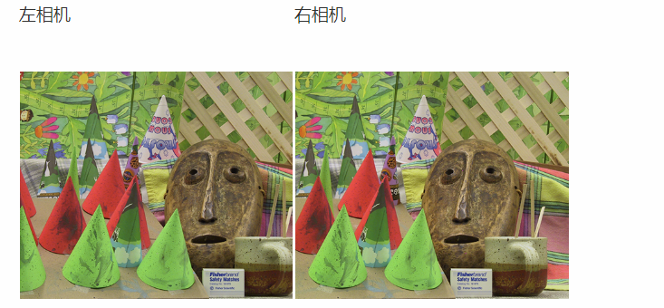

## 图像视差匹配

##### 原理

​	从人的角度来看，双目立体视觉是指我们的大脑通过两只眼睛捕捉到的不同图像来产生深度感和三维空间感的能力。从机器的角度来看，双目立体视觉是指使用两台相机从不同角度拍摄物体的图像，然后计算图像中对应点之间的位置偏差，根据视差原理获得物体的三维几何信息。双目立体视觉主要涉及四个步骤：相机校准、立体校正、立体匹配和视差计算。一个多视图成像的特殊例子是立体视觉(或者立体成像)，即使用两台只有水平(向一侧)偏移的照相机观测同-.场景。当照相机的位置如上设置，两幅图像具有相同的图像平面，图像的行是垂直对齐的，那么称图像对是经过矫正的。该设置在机器人学中很常见，常被称为立体平台。通过将图像扭曲到公共的平面上，使外极线位于图像行上，任何立体照相机设置都能得到矫正(我们通常构建立体平台来产生经过矫正的图像对)。假设两幅图像经过了矫正，那么对应点的寻找限制在图像的同一行上。一旦找到对应点，由于深度是和偏移成正比的，那么深度(Z坐标)可以直接由水平偏移来计算,

##### 实现——相似度匹配，视差计算

1. 读入两个角度照片的灰度图

2. 用左图的图像块去遍历右图的图像块

3. **使用三种不同的相似度度量方法去获得最佳视差值**

4. 输出最佳视差图和计算时间

   

   

###### 三种相似度的实验结果

###### 计算时间

| window_size |  3   |  15  |  21  |
| :---------: | :--: | :--: | :--: |
|     SAD     | 81s  | 109s | 63s  |
|     SSD     | 55s  | 60s  | 64s  |
|     NCC     | 547s | 674s | 645s |

##### 分析

###### SAD算法的效果

SAD（绝对差值和）算法的表现较差。使用小窗口大小（如3x3）时，所有三种算法（SAD、SSD和NCC）都会在结果中生成大量噪声点。SSD（平方差和）相比SAD生成的噪声点稍少，而NCC（归一化互相关）生成的噪声点最多，严重影响了远处物体（如围栏）的清晰度。

###### 错误表现

在SAD和SSD的结果中，深度不准确通常表现为离散点或聚集区域。相比之下，NCC输出中的错误更均匀分布，表现为密集的分散点，聚集较少。

###### 窗口大小的变化

将窗口大小增加到7x7或15x15时，SSD在视点较近的物体上显示出更少的不准确性，尽管某些区域显示出夸大的错误。相比之下，NCC在更远的物体距离上提供了更平滑的表示，如图4.6所示，尽管视差图中的颗粒感更明显。当窗口大小扩展到21x21时，SAD生成的噪声点比SSD和NCC更少，但三种算法都在物体形状中引入了一些失真。

###### 计算时间

NCC始终要求最长的计算时间，而SAD和SSD在所有测试场景中完成得更快。

基于多次试验，建议使用SSD或NCC算法并选择适中的窗口大小(15x15)以获得更精确的结果，或者使用窗口较小（如3x3）的SAD算法以在计算需求较低的情况下获得可接受的结果